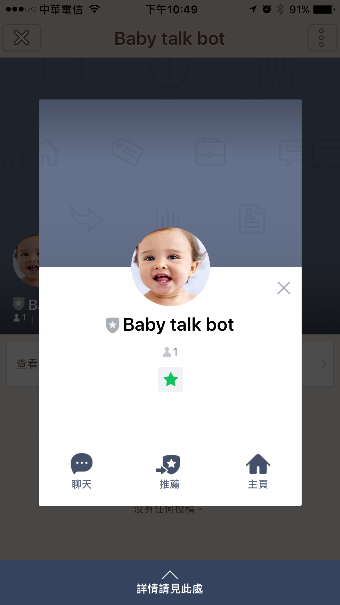
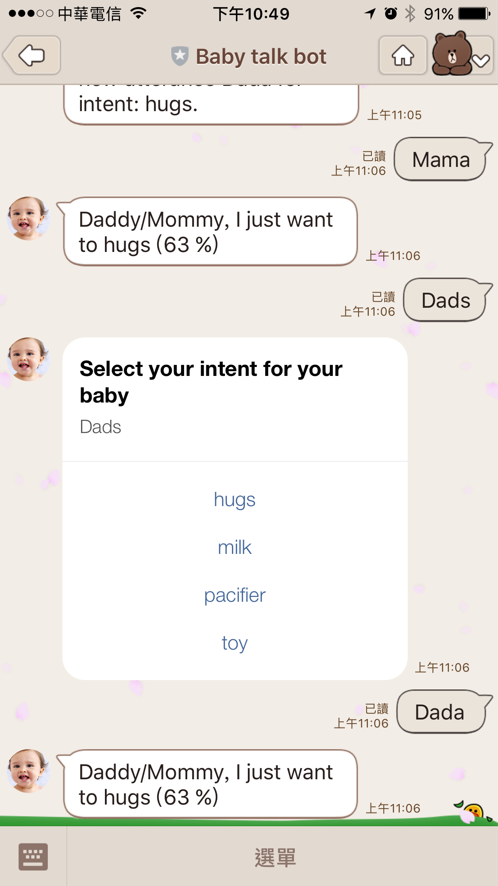

BabyLuisBot: A database-free neural-language learning Line ChatBot
==============

   

## Features:

- You don't need any database to have a NLU chatbot.
- You event don't need any fee (almost) for this chatbot. (Heroku free-tier with free usage of [LUIS](https://www.luis.ai/))

How to use it
---------------

### Add friend:

### Teach your baby:

- Input the word from your baby, such as "momy", "daddy" even "ne ne ..."

- Input what he/she realy want, after you realize it.

- Every time you input, your baby bot will try to learn your word. After few seconds your babt will learn it and tell you what they want.

### Auto-train and feedback: 

Everytime your baby learn a new utterance from you, it will trigger auto-retrain. 

### Limitation:

Because this project is just a POC (Proof of Concept), so it still don't support for multiple user online.

It might have some issues if multiple user on line.

How to write your LUIS Chatbot in Golang
---------------

- Just click following button to deploy yours in Heroku.

Note:

1. Refer [my LineBotTemplate project](https://github.com/kkdai/LineBotTemplate) for how to create your own Line Bot.
2. Refer [my Luis project](https://github.com/kkdai/luis) to know how to get `APP_ID` and `API_KEY`.

- You will need a [LUIS](https://www.luis.ai/) account and create related service.
- Add `APP_ID` and `API_KEY` in your heroku "Config Variables".
- You need create your intent first, or you could refer my intents list 
  - "hugs": Your baby just want hug.
  - "milk": Your baby want drink milk.
  - "pacifier": Your baby want to pacifier.
  - "toy": Your baby need a toy and want to play.
- You will need to publish your LUIS model at least one time before Line bot run.

License
---------------

Licensed under the Apache License, Version 2.0 (the "License");
you may not use this file except in compliance with the License.
You may obtain a copy of the License at

http://www.apache.org/licenses/LICENSE-2.0

Unless required by applicable law or agreed to in writing, software
distributed under the License is distributed on an "AS IS" BASIS,
WITHOUT WARRANTIES OR CONDITIONS OF ANY KIND, either express or implied.
See the License for the specific language governing permissions and
limitations under the License.

